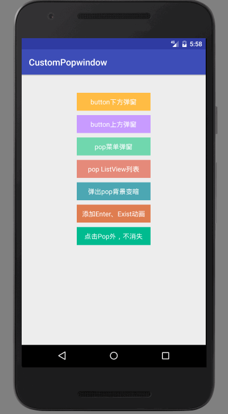

### 封装通用PopupWindow,CustomPopWindow,使用链式的方式配置并显示

由于每次写PopupWindow都要写很多重复代码，因此简单的封装了一个CustomPopWindow.封装了PopupWindow 的一些常用API，使用Builder模式，就像写AlertDialog 一样，链式配置。

### 相关博客

1，[通用PopupWindow，几行代码搞定PopupWindow弹窗](http://www.jianshu.com/p/9304d553aa67)

2, [通用PopupWindow，几行代码搞定PopupWindow弹窗（续）](http://www.jianshu.com/p/46d13fe78099)

3, [从源码剖析PopupWindow 兼容Android 6.0以上版本点击外部不消失](http://www.jianshu.com/p/c9a83decb314)

### Usage

**由于 1.0.0 版本 是托管到 Jcenter的，添加如下依赖：**

Add the dependency to your build.gradle.


```java
dependencies {
    compile 'com.example.zhouwei.library:library:1.0.0'
}
```

 **2.x 版本 代码托管到Jitpack, 需要如下依赖：**
 
1. Add it in your root build.gradle ：
 ```java
     
 allprojects {
     epositories {
         ...
         maven {
             url 'https://jitpack.io'
 
         }
 
 }
 ```
 
2. Add the dependency
```java
dependencies {
	compile 'com.github.pinguo-zhouwei:CustomPopwindow:2.1.1'
}
```

**示例效果图：**




### 更新日志

**v2.0.0：**

* 1,添加弹出PopupWindow同时背景变暗的配置，添加配置动画

**v2.1.0：**

* 1, 兼容Android 6.0 、Android 7.0 点击PopupWindow 之外的区域可以控制 **显示/关闭popupWindow**
* 2, 可以获取到PopupWindow实例
### 使用方法


更新1:背景变暗配置示例：

```java
   //创建并显示popWindow
 mCustomPopWindow= new CustomPopWindow.PopupWindowBuilder(this)
                .setView(contentView)
                .enableBackgroundDark(true) //弹出popWindow时，背景是否变暗
                .setBgDarkAlpha(0.7f) // 控制亮度
                .create()
                .showAsDropDown(mButton5,0,20);
```
更新2:显示消失动画配置：

```java
 CustomPopWindow popWindow = new CustomPopWindow.PopupWindowBuilder(this)
                .setView(R.layout.pop_layout1)
                .setFocusable(true)
                .setOutsideTouchable(true)
                .setAnimationStyle(R.style.CustomPopWindowStyle) // 添加自定义显示和消失动画
                .create()
                .showAsDropDown(mButton1,0,10);
```

更新3:点击PopupWindow以外区域不让关闭(默认DisMiss)：

```java
 mPopWindow = new CustomPopWindow.PopupWindowBuilder(this)
                .setView(view)
                .enableOutsideTouchableDissmiss(false)// 设置点击PopupWindow之外的地方，popWindow不关闭，如果不设置这个属性或者为true，则关闭
                .create();

        mPopWindow.showAsDropDown(mButton7,0,10);
```


1，简便写法
```java
CustomPopWindow popWindow = new CustomPopWindow.PopupWindowBuilder(this)
                .setView(R.layout.pop_layout1)//显示的布局，还可以通过设置一个View
           //     .size(600,400) //设置显示的大小，不设置就默认包裹内容
                .setFocusable(true)//是否获取焦点，默认为ture
                .setOutsideTouchable(true)//是否PopupWindow 以外触摸dissmiss
                .create()//创建PopupWindow
                .showAsDropDown(mButton1,0,10);//显示PopupWindow
```
以上就是弹出一个简单的PopupWindow，是不是看起来很优雅和简单，还可以简单一点：

```java
CustomPopWindow popWindow = new CustomPopWindow.PopupWindowBuilder(this)
                .setView(R.layout.pop_layout1)//显示的布局
                .create()//创建PopupWindow
                .showAsDropDown(mButton1,0,10);//显示PopupWindow
```
如果是一个简单的只展示文案的弹窗，就可以只设置一个View，就可以了，很简单吧！！！

2，展示一个PopupWindow 弹窗菜单（像手机QQ，微信的顶部菜单）
```java
View contentView = LayoutInflater.from(this).inflate(R.layout.pop_menu,null);
        //处理popWindow 显示内容
        handleLogic(contentView);
        //创建并显示popWindow
        mCustomPopWindow= new CustomPopWindow.PopupWindowBuilder(this)
                .setView(contentView)
                .create()
                .showAsDropDown(mButton3,0,20);
```
如果PopupWindow 展示的内容需要在程序代码中设置或者响应点击事件等，可以现获取到这个View，然后处理一些显示和点击事件逻辑，再交给CustomPopWindow 创建显示。比如响应菜单点击事件的逻辑处理：
```java
 /**
     * 处理弹出显示内容、点击事件等逻辑
     * @param contentView
     */
    private void handleLogic(View contentView){
        View.OnClickListener listener = new View.OnClickListener() {
            @Override
            public void onClick(View v) {
                if(mCustomPopWindow!=null){
                    mCustomPopWindow.dissmiss();
                }
                String showContent = "";
                switch (v.getId()){
                    case R.id.menu1:
                        showContent = "点击 Item菜单1";
                        break;
                    case R.id.menu2:
                        showContent = "点击 Item菜单2";
                        break;
                    case R.id.menu3:
                        showContent = "点击 Item菜单3";
                        break;
                    case R.id.menu4:
                        showContent = "点击 Item菜单4";
                        break;
                    case R.id.menu5:
                        showContent = "点击 Item菜单5" ;
                        break;
                }
                Toast.makeText(MainActivity.this,showContent,Toast.LENGTH_SHORT).show();
            }
        };
        contentView.findViewById(R.id.menu1).setOnClickListener(listener);
        contentView.findViewById(R.id.menu2).setOnClickListener(listener);
        contentView.findViewById(R.id.menu3).setOnClickListener(listener);
        contentView.findViewById(R.id.menu4).setOnClickListener(listener);
        contentView.findViewById(R.id.menu5).setOnClickListener(listener);
    }
}
```
3,展示一个ListView,其实跟上面是一样的，这里贴一下实例代码：
```java
private void showPopListView(){
        View contentView = LayoutInflater.from(this).inflate(R.layout.pop_list,null);
        //处理popWindow 显示内容
        handleListView(contentView);
        //创建并显示popWindow
        mListPopWindow= new CustomPopWindow.PopupWindowBuilder(this)
                .setView(contentView)
                .size(ViewGroup.LayoutParams.MATCH_PARENT,ViewGroup.LayoutParams.MATCH_PARENT)//显示大小
                .create()
                .showAsDropDown(mButton4,0,20);
    }

    private void handleListView(View contentView){
        RecyclerView recyclerView = (RecyclerView) contentView.findViewById(R.id.recyclerView);
        LinearLayoutManager manager = new LinearLayoutManager(this);
        manager.setOrientation(LinearLayoutManager.VERTICAL);
        recyclerView.setLayoutManager(manager);
        MyAdapter adapter = new MyAdapter();
        adapter.setData(mockData());
        recyclerView.setAdapter(adapter);
        adapter.notifyDataSetChanged();

    }
```

### 联系方式
 简书:[http://www.jianshu.com/u/35167a70aa39](http://www.jianshu.com/u/35167a70aa39)
 
 掘金：[https://juejin.im/user/56949a9960b2e058a42be0ba](https://juejin.im/user/56949a9960b2e058a42be0ba)
 
 公众号：**Android技术杂货铺**
 
 QQ技术交流群：**155971357**
 
 欢迎关注我的公众号，第一时间获取我的博客更新提醒，以及更多有价值的原创Android干货文章、职场经验、面试技巧等等。
 长按下方二维码即可关注。

 

### License

```
   Copyright (C) 2017 zhouwei

   Licensed under the Apache License, Version 2.0 (the "License");
   you may not use this file except in compliance with the License.
   You may obtain a copy of the License at

       http://www.apache.org/licenses/LICENSE-2.0

   Unless required by applicable law or agreed to in writing, software
   distributed under the License is distributed on an "AS IS" BASIS,
   WITHOUT WARRANTIES OR CONDITIONS OF ANY KIND, either express or implied.
   See the License for the specific language governing permissions and
   limitations under the License.
```